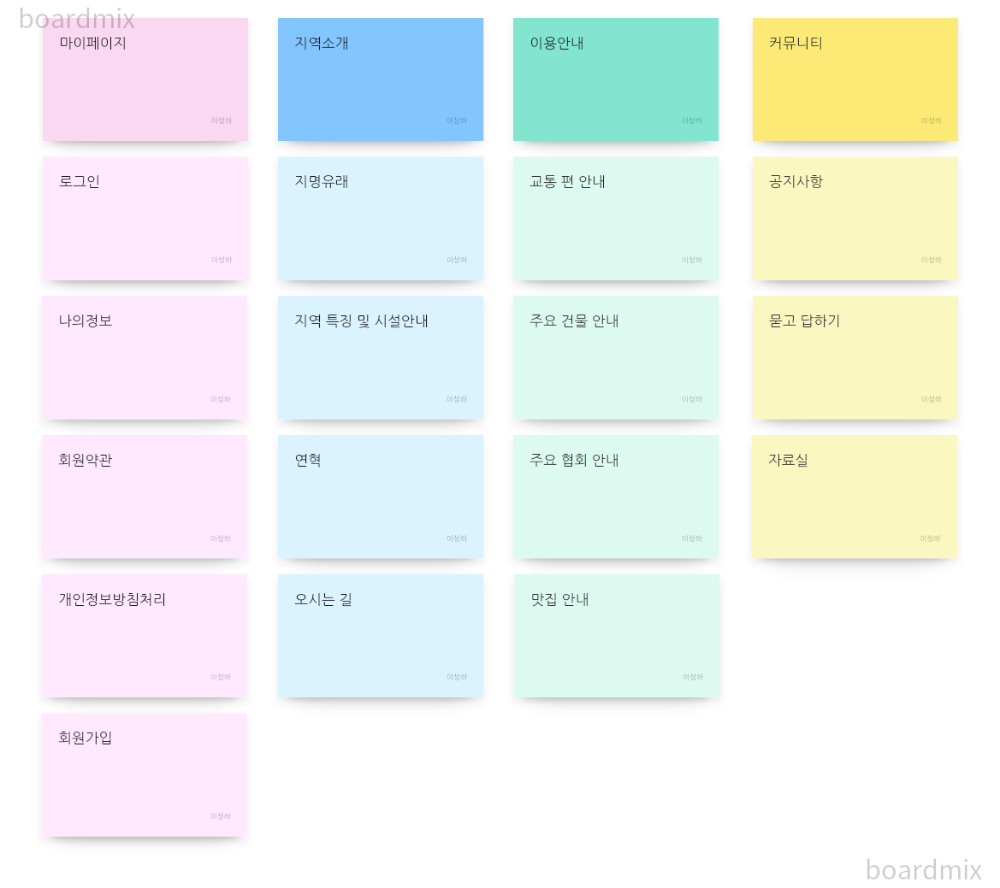
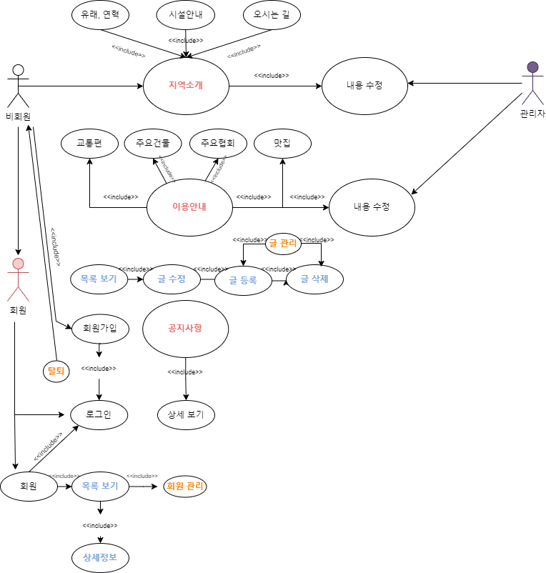
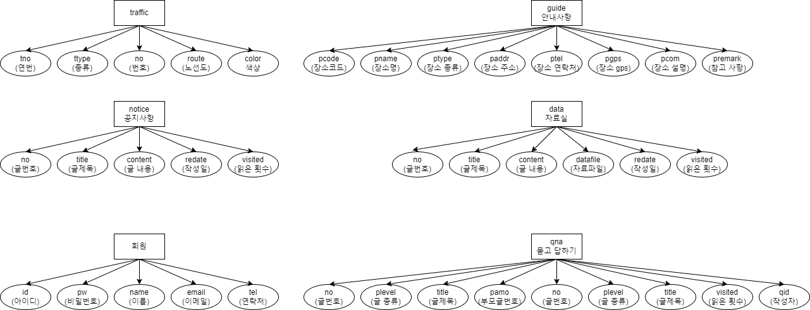
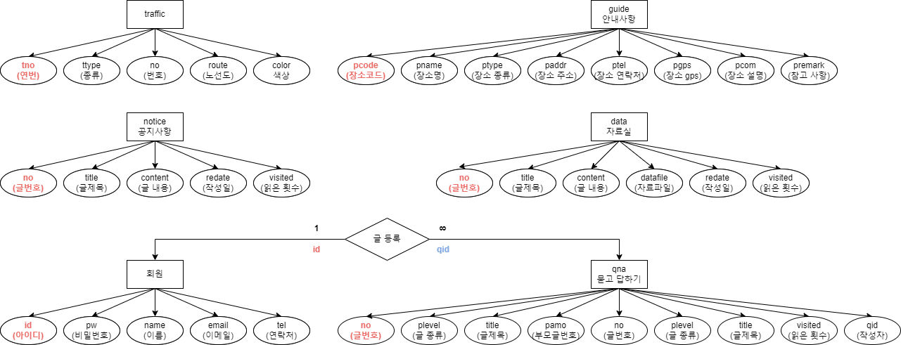
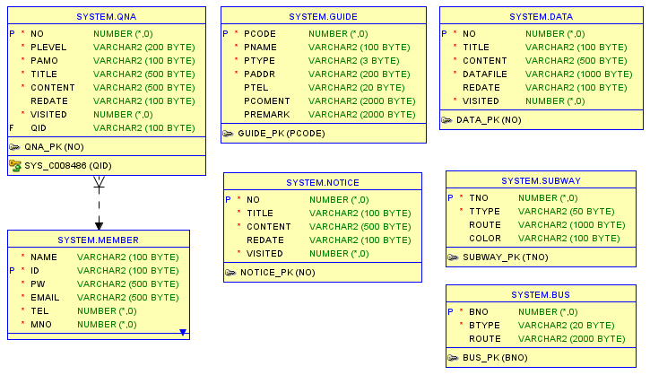

## 프로젝트 개발 보고서 (Project Development Report)
-----------------------
### 1. 프로젝트 개요 (Project Outline)

서울 교통의 중심지면서 ~인 왕십리를 소개하기 위한 웹 애플리케이션을 자바 기반의 웹 애플리케이션으로 개발하게 되었다.  

### 2. 프로젝트 목적 (Project Purpose)
왕십리의 유래와 동네의 특징, 그리고, 곳곳에 산재되어 있는 각 종 기관과
왕십리에 위치한 왕십리 주변의 빌딩, 맛집 등을 소개하고, 왕십리의 소식을 전달하며,
커뮤니티를 이루고, 정보를 공유할 목적으로 개발하게 되었다.

### 3. 프로젝트 개발 환경 정보 (Project Development Enviroment)

- Project Topic : Gasan-dong Intro Web Application
- Develope Environment : Open JDK 11
- Language : Java 11
- Web Module : Jsp/Servlet 3.0
- Process Pattern : MVC Pattern
- Database System(DBMS) : Oracle 21C XE
- Database Design : SQL Developer 23.1.1
- Entity Relationship Design : draw.io 20.8.16
- Java Database Connector : ojdbc11
- Application Design : Object aid 1.2.4
- Back Template Language : Java/Servlet 11
- Front Template Language : Jsp(JSTL/EL) 3.0/HTML5/CSS3/Javascript ES5
- Web (Application) Server : Tomcat 9.0
- Navigation Design : WordCloud 3.7, Card Sort BoardMix
  
### 4. 프로젝트 기획 및 설계 (Project Planning & Design)

### 4-1. 네비게이션 설계 (Navigation Design)
| 마이페이지 | 지역소개 | 이용안내 | 커뮤니티 |
|--------|--------|--------|--------|
| 로그인 | 지명유래 | 교통편 안내 |  공지사항 |
| 회원 정보 | 지역특징 및 시설안내 | 주요 건물 안내 | 묻고 답하기 |
| 회원약관 | 연혁 | 주요 협회 단체 | 자료실 |
| 개인정보처리방침 | 오시는길 | 맛집안내 | &nbsp; |
| 회원가입 | &nbsp; | &nbsp; | &nbsp; |

#### 4-1-1. 자료 수집

 

#### 4-1-2. 콘텐츠 분류 (Content cort)

 

#### 4-1-3. 서비스 흐름 설계 (Service Flow Design)

#### 4-1-4. 서비스 시나리오 (Service User Scenario)

**회원 / 비회원 사용자 시나리오(Member User Scenarion)**
1. 지역 소개인 지명 유래와 연혁을 탐색한다.
2. 지역 소개인 지역 특징 및 시설 안내를 탐색한다.
3. 해당 지역의 지도가 궁금하여 오시는 길을 탐색한다.
4. 해당 지역의 교통 편을 알아보고, 방문을 계획한다.
5. 사용자는 어디 어디에 방문할지 주요 건물과 맛집 등을 확인한다.
6. 해당 지역의 이벤트나 특이사항을 확인하기 위하여 공지사항의 글을 확인한다.
7. 공지사항의 글을 확인하거나 질문을 위하여 회원 가입을 시작한다.
8. 회원 가입을 시작하게 되면, 회원 약관 및 개인 정보처리 방침에 동의하도록 한다.
9. 회원 가입 페이지에서 필수 정보를 입력하고 아이디의 중복 확인을 거쳐 회원 가입을 완료한다.
10. 회원 가입 후 로그인을 하도록 한다.
11. 공지 사항 글을 확인하고 해당 정보가 없는 경우 궁금한 사항을 질문하기 위해 묻고 답하기로 이동한다.
12. 묻고 답하기 페이지에서 질문에 대한 관련 답이 있는지 검색한다.
13. 해당 정보가 있으면 그 글을 확인하고 없으면 질문을 등록한다.
14. 카달로그나 가이드가 있는지 확인하기 위해 자료실을 탐색한다.
15. 해당 자료가 있음을 확인하고, 자료를 다운로드한다.

**관리자 시나리오(Administrator Scenarion)**

1. 관리자로 로그인한다.
2. 공지사항 목록을 확인하고 누락된 정보가 있는지 확인한다.
3. 해당 지역의 이벤트나 특이사항을 공지사항으로 등록한다.
4. 변동된 내용이 있을 경우 수정한다.
5. 이벤트나 특이사항 중 취소된 내용이 있어 공지사항 글을 삭제한다.
6. 묻고 답하기 목록으로 이동하여 등록된 질문을 확인 후 답변을 등록한다.
7. 만약, 스팸 글이나 불필요한 질문이 있는 경우에는 해당 글을 삭제하도록 한다.
8. 카달로그나 가이드가 새롭게 발생한 경우 자료실에 해당 글을 쓰고 자료를 등록한다.
9. 지역 소개에 대한 변동이 있을 때 해당 페이지에 내용을 수정한다.
10. 이용 안내에 대한 변동사항이 있어 새로운 내용으로 변경한다.
11. 회원 목록으로 이동하여 신규 회원이나 탈퇴 회원을 확인하도록 하고 현재 제적 사유에 해당하는 회원은 강퇴시키도록 한다.

### 4-2. 데이터베이스 설계

#### 4-2-1. 개념적 설계

#### 4-2-2. 논리적 설계

#### 4-2-3. 물리적 설계

